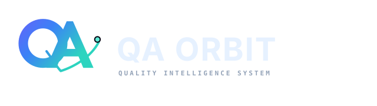
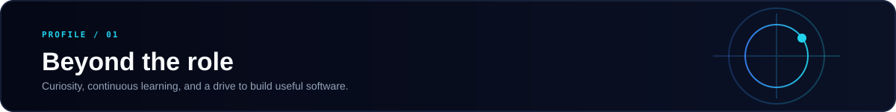
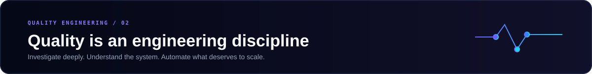
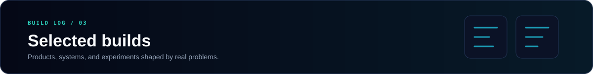
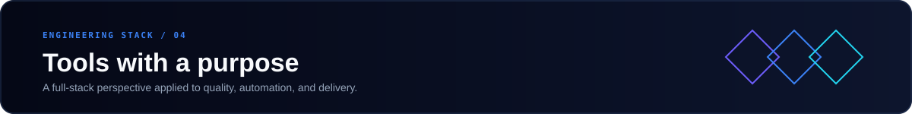
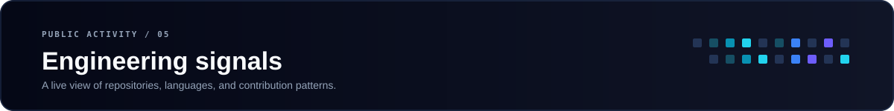
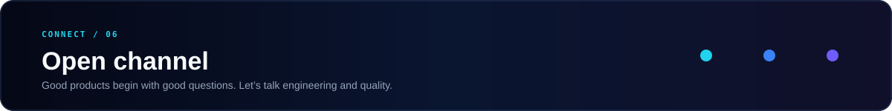

  

 

  <strong>QA Engineer · Automation Specialist · Full Stack Builder</strong> 
  Building software where quality, engineering, and intelligent automation meet.

 

---

  

### My flagship project

QA Orbit is a platform in active development for connecting software quality, automation, team knowledge, and AI-assisted workflows in one place.

`TEST MANAGEMENT` · `AUTOMATION` · `AI-ASSISTED QA` · `QUALITY PRODUCTIVITY`

> **The idea:** QA should not be a disconnected final checkpoint. It should move with the product, preserve context, and make every engineering cycle smarter.

**Conceptual workflow** 
Requirements → Test Planning → Smart Recorder → Automation Builder → QA Agent → Execution → Evidence → Continuous Improvement

`STATUS / ACTIVE DEVELOPMENT`

 

  

I am a QA Engineer and Full Stack Developer with a degree in Systems Analysis and Development. I enjoy understanding how products work beneath the interface — and turning that understanding into better tests, better tooling, and better software.

- Quality engineering is my main discipline.
- Full-stack development expands how deeply I can investigate and build.
- Technology is where curiosity becomes something useful.
- Continuous learning is part of the work, not a separate activity.

 

  

### How I work as a QA Engineer

I do not treat testing as a checklist. I approach quality as an investigation across the entire system.

`ROOT-CAUSE ANALYSIS` · `ARCHITECTURE` · `DATABASES` · `LOGS`

`REPRODUCTION` · `AUTOMATION` · `DEV COLLABORATION` · `AI-ASSISTED WORKFLOWS`

- I reproduce problems until their behavior is understood, not merely observed.
- I use logs, data, APIs, and architecture to find where a failure actually begins.
- I automate repetitive work when it improves feedback and maintainability.
- I work close to development because quality decisions are engineering decisions.

 

  

> ### QA Orbit · Flagship
> Quality engineering platform connecting automation, knowledge, and AI-assisted workflows.
>
> **Status:** Active Development

> ### [Sheila System](https://github.com/leoschmitt98/sheila-projeto) · Production SaaS
> Multi-tenant platform for scheduling, service operations, finance, and automated customer flows, with Cypress E2E coverage.
>
> **Status:** In Production · [View product](https://landingpage.sheilasystem.com.br/)

> ### EJL System · Private Build
> A selected project whose technical details will be published when they are ready for public presentation.
>
> **Status:** Private

> ### [Automation Projects](https://github.com/leoschmitt98?tab=repositories&q=automacao&type=&language=&sort=) · QA Lab
> Practical repositories exploring browser automation, Page Object patterns, controlled API responses, and test design.
>
> **Status:** Public Experiments

 

  

  

### Frontend

`React` · `TypeScript` · `Tailwind CSS`

### Backend

`Node.js` · `Express` · `REST APIs`

### Quality Engineering

`Cypress` · `Playwright` · `Selenium` · `E2E Automation` · `API Testing`

### Data & Delivery

`SQL Server` · `Docker` · `Git` · `GitHub Actions` · `Linux`

### Artificial Intelligence

`AI-assisted investigation` · `Quality workflows` · `Automation productivity`

 

  

  

  
  

These cards reflect public GitHub data and may be temporarily unavailable if the external rendering service reaches its limits.

 

  

[GitHub](https://github.com/leoschmitt98) · **LinkedIn — public URL to be added** · **Email — public address to be added**

 

**I build to understand. I test to improve. I keep learning to build what comes next.**

